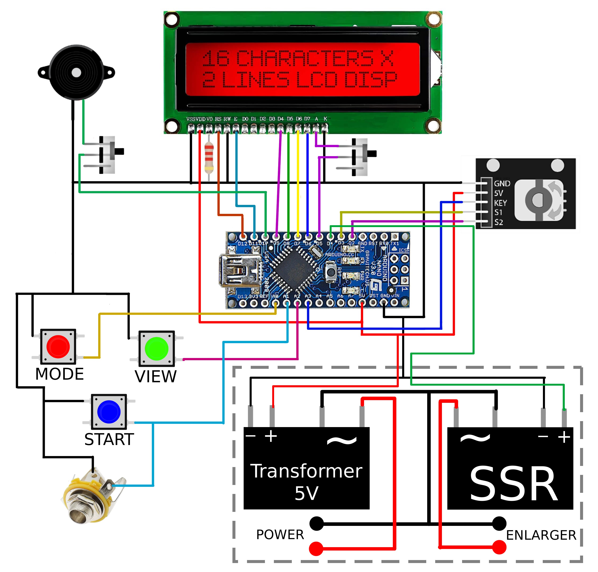

# Advanced darkroom timer (KAF Red_Ray Timer RR-1)

> [Инструкция на русском](./README_RU.md)

> This project is inspired by [this one](https://github.com/nikonov1101/kafstop-timer), but improve it and extend functions

> [3D Model of the body](https://www.thingiverse.com/thing:6683466)

> [Youtube playlist with assembling manual (in Russian)](https://www.youtube.com/watch?v=XjmDx0XmCiA&list=PLLB8YXu4D8PvZlZFQPj_stn8mG01y7iiN&pp=gAQB)

> **Main idea:** You prepare everything in light and click only Start btn during printing

> [Online simulator](https://wokwi.com/projects/438924953572456449). Note, you can use keyboard to control timer

## Manual

1. Click view btn to turn on/off a lamp
2. Hold mode btn and turn encoder, to switch mode
3. Click mode btn to navigate inside mode
4. Hold encoder btn to reset current printing at any mode (inside mask mode you can fast travel between masks)
5. Turn encoder in time table to scroll it
6. Click start btn to start printing at any mode
7. Hold view and change mode btns to go to settings

## Settings

1. Lamp's heatup time (Lag time)
2. LED Backlight
3. Beep volume
4. Auto turn off lamp time in view mode
5. Start with settings or not

## Modes

1. F Stop test mode: increae testing time in stops
2. Linear test mode: simple mode for linear testing
3. Print mode: ability to pause printing at any time. It's creative mode and usefull for thoughtless printing
4. Mask mode: for printing with accurate masks. Click encoder btn to go to the next mask. Hold encoder btn and turn encoder to fast travel between masks. Click start btn when set mask to play melody after printing this mask -- usefull, when you don't want to forgot to do something. For example, change filter.
5. Rel mask mode: the same as mask mode, but operates with relative times: you set base time and relative times (in stops) to it. Notification system is disabled. To see real time in seconds: click on encoder during run
6. Split grade test modes: the same as fstop and linear test modes, but allows to set base time. After printing base, the melody is playing to not forget change filter
7. Split mask and rel mask modes: the same as mask and rel mask modes, but allows to set mask for two filtres (0 and 5). Notification system is disabled.
8. Localized test modes the same as fstop and linear test modes, but used to test the same region on photo. The time you see -- it's whole printing test time. [3D model of the test-strip maker](https://www.thingiverse.com/thing:7048981)

## Killer features:

1. Ability to stop any mode, during printing. Just hold encoder button. Usefull to stop process, if you forgot something
2. Ability to set lag time: lamp. It's could be usefull to get accurate results. To find it go to settings, choose minimum lag time and click start btn. Increase it till the moment of seeing that lamp is actually turn on
3. Autoturn off in view mode. It could preserve lamp on your enlarger if you forgot to turn off it
4. Buzzer that beep every second. Usefull to control the process, not looking at display
5. Simple architecture of the project allows easily extend functionality

## How to assamble

### Circuit diagram

#### Main part

> Note: Dashed part is power supply block. It's not a part of main body. The datailed scheme of power supply is shown lower



#### Power supply


### Hardware and body

My friend just create the coolest version of body for this project!!! You can find it [here](https://www.thingiverse.com/thing:6683466)

#### Components

1. [Encoder](https://sl.aliexpress.ru/p?key=d3DhGvG)
2. [Buttons](https://sl.aliexpress.ru/p?key=SoBfsmF)
3. [LED](https://sl.aliexpress.ru/p?key=tgDHsiN)
4. [Buzzer](https://sl.aliexpress.ru/p?key=iXIeG78)
5. [Switch](https://sl.aliexpress.ru/p?key=f3PfsRC)
6. [5V Transformer](https://sl.aliexpress.ru/p?key=5RdhGtS) (still don't check it properly). Also you can just disassamble any 5V USB phone adapter
7. [Arduino nano](https://sl.aliexpress.ru/p?key=daDhGj5): It's better to take Arduino with ATmega 328P processor. Arduino with ATmega 168 doesn't have anought memory to store this firmware. Notice, controller with mini usb socket is needed
8. Only one resistor is used to set contrast of screen: 2.2 kOm. Your value could differ.
9. You could buy sustain pedal as footswitch. It has to be normally-open or has polarity switch. We use "Cherub wtb-006" and it's more than ok
10. [Jack 6.35](https://sl.aliexpress.ru/p?key=W4aeGRp)
11. SSR:
    * If you want to use timer with any lamp (LED, halogen). You can buy any of it:
        - [D3803HK/D3805HK/D3808HK](https://sl.aliexpress.ru/p?key=xlW6GV3)
        - [BERM BRM-D480-5A](https://sl.aliexpress.ru/p?key=KyW6GRj)
        - [SSR-41FDA](https://sl.aliexpress.ru/p?key=oBW6G3x)
    * If you don't want to use timer with low wattage lamps (LED): you can buy [this popular SSR](https://sl.aliexpress.ru/p?key=wXDhGqU). This one has leakage in turned off state, and it's enough to power on the lamp

> **WARNING**: Don't use solenoid relays. It can lead to hieroglyphs on the display and even kill Arduino

This body has not enought space to keep transformer and SSR inside. You should put in special box for electronic. You could connect it with the body using, for example, XLR.

Body extra components:

1. [XLR](https://sl.aliexpress.ru/p?key=bFaeGJn) -- is used to connect main part with power block
2. [Acrilic black glass](https://sl.aliexpress.ru/p?key=tvaeGQb) -- cover display
3. [Power block sockets](https://sl.aliexpress.ru/p?key=xoaeGXb)
4. [Rocket switcher for power block](https://sl.aliexpress.ru/p?key=moaeG8T)
5. [M2 screws](https://sl.aliexpress.ru/p?key=rRaeGCg)
6. M3 screw and nuts also needed but you could buy it everywhere you want
7. [3 wire cabel 0.75 with AC Plug](https://sl.aliexpress.ru/p?key=Y0zn3DN) (Not tested)
8. [32AWG cabel 6 color set (5 meters each)](https://sl.aliexpress.ru/p?key=lsNn3rZ) (Not tested)
9. [Heat shrink tube 2 meters](https://sl.aliexpress.ru/p?key=ChNn3Wr) (Not tested)
10. [Transparent two sides tape](https://sl.aliexpress.ru/p?key=pbNn3xt)

### Low-budget versions of device

You can made body cheeper if
1. Don't install acrilic black glass. Just dim display in settings
2. Connect body to power supply directly without XLR
3. Use single color filament printed with 0.4 nozzle
4. Don't print text on body
5. Not use our version of power supply. Just put SSR and transformer into simple electrical enclosure and connect AC socket using wire to it

## Build and upload code to Arduino

If you want just upload code to your arduino without modification, then the simpliest way to do it is using of Arduino IDE
1. Install Arduino IDE
2. Clone this git project to any folder
3. Open ino file from Arduino IDE (`File`->`Open...`->`path to .ino` file)
4. Install dep libreries (`Tools` -> `Manage Libraries...`):
   * EncButton
   * LiquidCrystals
   * CRC32 (by Crystopher Baker)
5. Choose your board -- Arduino Nano and processor -- ATmega328P
6. Click Upload button

If you want to modify this code, then I recomment to use PlatfromIO:

```bash
# build from command line
cd DarkroomTimer/
pio run -t build

# upload to device
pio run -t upload
```

### Firmware configuration

You can configure the firmware by your needs. For this, you have to create a file UserConfig.h in near to 'DarkroomTimer.ino' file and define needed macroses. All possiable values and description specified in [UserConfig.example.h](DarkroomTimer/UserConfig.example.h). Example configuration:

```cpp
// UserConfig.h

// Change encoder direction
#define ENCODER_DT_PIN 3
#define ENCODER_CLK_PIN 2

// make encoder move faster
#define ENCODER_FAST_TIMEOUT 34
#define ENCODER_FAST_FAST_TIMEOUT 9

// Dim LCD if we not install acrylic cover
#define LCD_BACKLIGHT_STEP 2

// Make beeper quieter
#define BEEPER_VOLUME_MIN 10

// Fix beeper make a noise in turned off state
#define BEEPER_VOLUME_SILENT 0
```

We will try not change name of config macroses. So, you can use this file for different versions of firmware

## Support

If you have any questions, problems or suggestions, you are welcome to write us:)

Bogdan (design, 3d pringing):<br>
tg: [@bogdanbogvzyan](http://t.me/bogdanbogvzyan)<br>
email: [panasyukbv@yandex.ru](mailto:panasyukbv@yandex.ru?subject=Darkroom%20timer)

Petr (code, assembling):<br>
tg: [@lo1ol](http://t.me/lo1ol)<br>
email: [myprettycapybara@gmail.com](mailto:myprettycapybara@gmail.com?subject=Darkroom%20timer)
