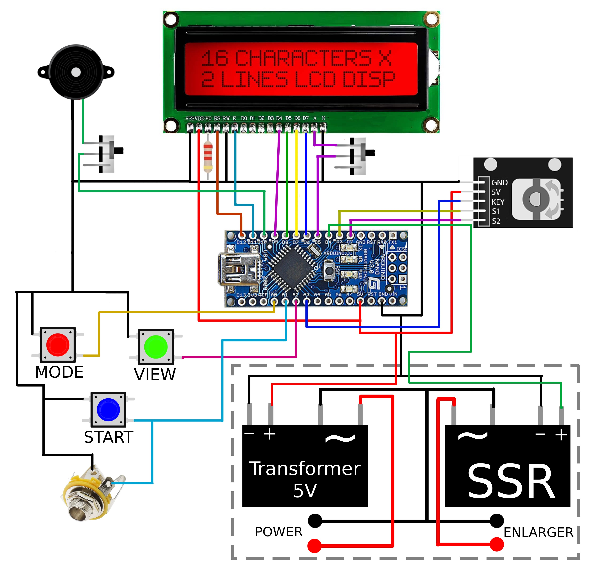
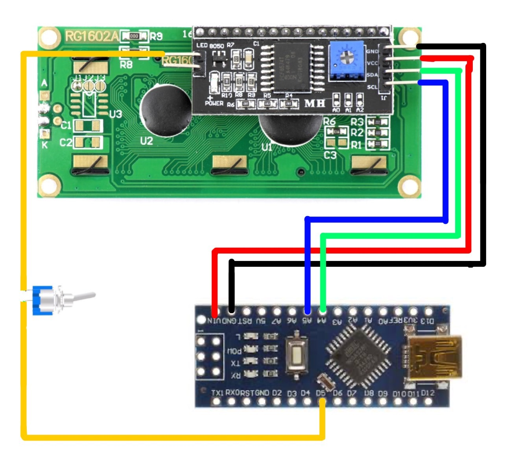
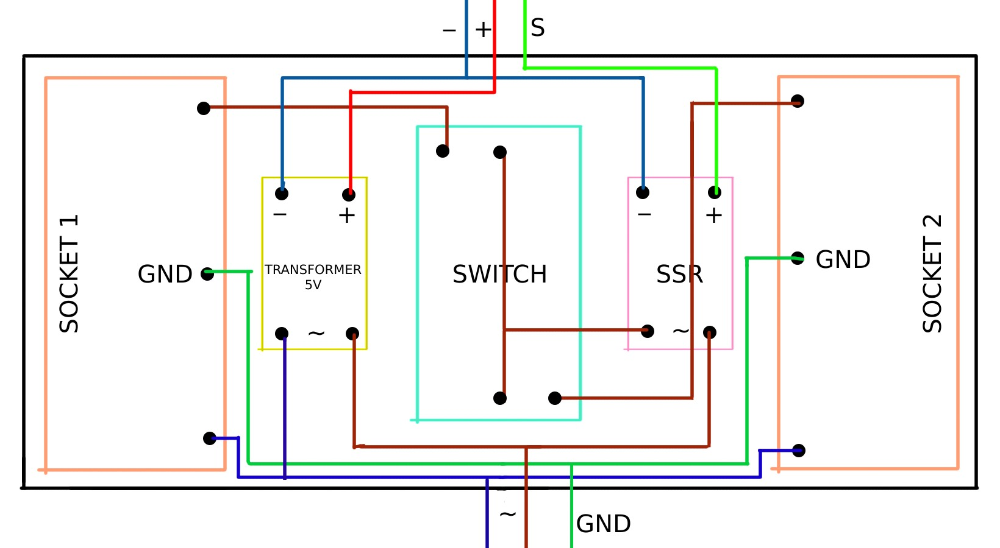

# Продвинутое реле времени. KAF Красный луч RR-1

> Этот проект вдохновлен [прошлой версией похожего реле](https://github.com/nikonov1101/kafstop-timer), но улучшает и расширяет его возможности

> [3D модель корпуса](https://www.thingiverse.com/thing:6683466)

> [Youtube плейслист с инструкцией по сборке](https://www.youtube.com/watch?v=XjmDx0XmCiA&list=PLLB8YXu4D8PvZlZFQPj_stn8mG01y7iiN&pp=gAQB)

> **Основная идея:** Вы подготавливаете все на свету, чтобы во время печати нажимать только на кнопку старта

> [Онлайн симулятор](https://wokwi.com/projects/438924953572456449). Заметьте, что в эмуляторе устройством удобнее управлять через клавиатуру

## Инструкция

1. Кликни кнопку просмотра, чтобы включить/выключить лампу
2. Удерживай кнопку режима и крути энкодер, чтобы переключаться между режимами
3. Кликни кнопку режима, чтобы перемещаться внутри режима
4. Удерживай кнопку на энкодере, чтобы сбросить печать в любом режиме (во время установок масок вы можете зажать и крутить энкодер, чтобы быстро перемещаться между масками)
5. Крути энкодер во время показа таблицы времени, чтобы перемещаться внутри нее
6. Кликни кнопку старта, чтобы начать печать в любом режиме
7. Удерживай нопку просмотра и переключения режима, чтобы войти в режим настроек

## Настройки

1. Лаг запуска лампы
2. Яркость подсветки
3. Громкость пищалки
4. Время автоотключения лампы в режиме просмотра
5. Возможность стартовать с настроек

## Режимы

1. Тест F стопами: позволяет произвести быстрый тест для подбора тона изображения повышая каждый следующий тест на заданный тон. Размер тона можно уменьшать.
2. Линейный тест: Задается начальное значение и шаг
3. Режим печати: можете задать время и печатать с ним. Дополнительно есть возможность остановки печати и печати по удержанию кнопки (удобно для маскирования и коротких выдержках).
4. Режим маскирования: задайте количество масок и время, которое нужено для засветки определенной маски. Нажмите кнопку на энкодере во время установки масок, чтобы перейти к следующей маске. Удерживайте кнопку на энкодере и крутите энкодер, чтобы бысто перемещаться во время устанки масок. Нажмите на кнопку старта, во время установки масок, чтобы поставить напоминание на конкретной маске. После печати маски с уведомлением проиграет милодия, которая напомнит вам сделать что-то, например, сменить фильтр
5. Режим относительного маскирования: аналогичен обычному маскированию, но времена задаются относительно: указывается базовое время и в масках указывается количество стопов относительно него. Уведомления не работают. Для того, чтобы увидеть реальные времена, нажмите на encoder во время печати
6. Сплит грейд тесты: аналогичны тестам F стопами и линейным тестам, но с возможностью выставить начальное время экспонирования (время засветки первым фильтром). После печати базового времени играет мелодия, чтобы вы не забыли сменить фильтр
7. Сплит режимы маскирования и относительного маскирования: аналогичены обычным, но маски можно задавать для двух фильтров (0 и 5). Уведомления не работают
8. Локализованные тестовые режимы: аналогичны тестам F стопами и линейным тестам, но используемые для печати одинаково сегмента. Время которое сейчас показывается -- полное время печати теста. [3D модель инструмента, чтобы делать полоски можно найти здесь](https://www.thingiverse.com/thing:7048981)

## Killer фичи:

1. Есть возможность останоить любую печать. Это может быть удобно, если вы обнаружили, что забыли убрать красный фильтр
2. Есть возможность задать лаг запуска лампы. Некоторые фотоувеличители запускают лампу не сразу, а с некоророй задержкой. Чтобы компенсировать это значение, задайте лаг старта. Это значение будет отсчитываться перед любым запуском таймера и не будет учитываться. Чтобы определить задержку, перейдите в настройки и установите значение на глаз. Нажмите на кнопку старт, чтобы проверить его. Если за это время лампа не включилась, увеличьте это значение, иначе попробуйте уменьшить.
3. Пищилка, которая срабатывает раз в 1 секунду. Удобно для быстрого маскирования.
4. Возможность выставлять время автоотключения лампы при просмотре. Это увеличит срок службы лампы в вашем фотоувеличителе
5. Возможность отключения подсветки дисплея. Удобно для цветной печати
6. Простая архитектура проекта, которая позволит вам с легкостью добавить новые настройки и режимы по необходимости

## Сборка

### Схема

#### Основная часть

> Note: часть выделенная пунктиром -- это блок питания. Его подробная схема представлена ниже



#### I2C версия LCD

> Note: эта схема показывает только как припаять  I2C адаптер к ардуино. Все остальное должно быть припаяно также

> Note: не забудьте установить макрос `LCD_VERSION` в значение `LCD_VERSION_I2C` в [UserConfig.h](./DarkroomTimer/UserConfig.example.h)




#### Блок Питания



### Корпус

Мой товарищь сделал самый крутой корпус, который вы только сможете представить!!! Вы можете найти его [здесь](https://www.thingiverse.com/thing:6683466)

#### Компоненты

> Note: Это список компонентов, которые я использовал для своей сборки. Вы можете использовать другие схожие компоненты с других лотов или сайтов. Но я не могу гарантировать, что они 100% подойдут

1. [Энкодер EC11 модуль](https://sl.aliexpress.ru/p?key=d3DhGvG)
2. [Кнопки 3 шт.](https://sl.aliexpress.ru/p?key=SoBfsmF)
3. [Активный зумер 5V](https://sl.aliexpress.ru/p?key=iXIeG78)
4. [Переключатель SS12F15G5 2 шт.](https://sl.aliexpress.ru/p?key=f3PfsRC)
5. [Трансформатор на 5V 700mA](https://sl.aliexpress.ru/p?key=5RdhGtS) (Не проверен полноценно). Также  вы можете просто разобрать любую 5В USB зарядку для телефона
6. [Arduino Nano ATMEGA328P/Type-C или Mini USB/без припаянных пинов](https://sl.aliexpress.ru/p?key=daDhGj5)
7. [Jack 6.35 (mono)](https://ali.click/dv3xku)
8. Твердотельное реле 5V:
    * Если вам нужна работа с любыми лампами (LED, галогенные):
        - [D3803HK/D3805HK/D3808HK](https://sl.aliexpress.ru/p?key=xlW6GV3)
        - [BERM BRM-D480-5A](https://sl.aliexpress.ru/p?key=KyW6GRj)
        - [SSR-41FDA](https://sl.aliexpress.ru/p?key=oBW6G3x)
        - [RUICHI SSR G7DA-48(Z)D3](https://ozon.ru/t/3Wmz3qN). Есть еще версия на на 240V, но я ее не проверял
    * Если вам не нужна работа с маломощными лампами (LED), можете взять [эту](https://sl.aliexpress.ru/p?key=wXDhGqU). Это реле пропускает небольшой ток в закрытом состоянии и маломощные лампы будут просвечивать
9. Красный LCD 1602.
    * [LCD с I2C адаптером](https://ali.click/7j3xkl). Самый удобный вариант. Нужно припаять всего 5 пинов. Контраст настраивается на I2C модуле
    * [LCD без I2C адаптера](https://ali.click/kl3xk2). Сложнее паять. Может потребовать резистор для ренулировки контраста, но мне он был не нужен
    * [Еще один LCD без I2C адаптера](https://sl.aliexpress.ru/p?key=tgDHsiN). Использует дополнительный резистор для регулировки контраста: 2.2 кОм. Значение резистра может отличаться от моего.
10. [Педаль-сустейна](https://ali.click/4k4xk0) (Опционально). Выможете купить другую. Педаль должна быть нормально-открытой или иметь переключатель полярности

> **WARNING**: не используйте в качестве замены SSR электромагнитные реле. Они создают помехи в цепи, которые приводят к странным символам на экране и могут вывести ардуино из строя

В корпусе нет места для реле и трансформатора. Их лучше вынести в отдельный специальный корпус для РЭА и подключать, например, по XLR. Так будет безопаснее и корпус из-за этого выглядит лучше:)

Дополнительные детали для корпуса:
1. [XLR мама и папа](https://sl.aliexpress.ru/p?key=bFaeGJn) -- используется, чтобы соедитить основную часть с блоком питания
2. [Акриловое полупрозрачноечерное стекло 3мм](https://sl.aliexpress.ru/p?key=tvaeGQb) -- чтобы закрыть дисплей
3. [Разетки для блока питания](https://sl.aliexpress.ru/p?key=xoaeGXb)
4. [Переключатель для блока питания](https://sl.aliexpress.ru/p?key=moaeG8T)
5. [Винты M2 6мм 10 шт.](https://sl.aliexpress.ru/p?key=rRaeGCg)
6. Винты и гайки M3. Можете купить где угодно
7. [Трехжильный сетевой шнур 0.75 со штепселем на блок питания](https://www.chipdip.kz/product0/494606311) или [такой (не проверен)](https://sl.aliexpress.ru/p?key=Y0zn3DN)
8. [Монтыжные провода 0.2 для распайки электроники](https://www.chipdip.kz/product/amp30-mgshv-0.2) или [такие (не проверены)](https://sl.aliexpress.ru/p?key=lsNn3rZ)
9. [Термоусадочная трубка 2 метра 4.8мм](https://www.chipdip.kz/product/iske-h-3x-4.5-1.5-black) или [такая (не проверена)](https://sl.aliexpress.ru/p?key=ChNn3Wr)
10. [Двусторонний полупрозрачный скотч 3мм](https://sl.aliexpress.ru/p?key=pbNn3xt)

### Как удешевить корпус

Вы можете удешевить устройство если:
1. Не будете устанавливать акриловое стекло. Просто затемните его через настройки
2. Подключите основную часть корпуса к блоку питания напрямую без XLR
3. Используйте при печати филамент одного цвета. Печатайте все с соплом 0.4
4. Не наносите надписи на корпус
5. Не используйте нашу версию блока питания. Просто поместите SSR и трансформатор в бокс для электроники, а розетку для подключения увеличителя подсоедините по проводу

## Сценарий использования

Интерфейс реле устроен таким образом, чтобы соответствовать вашему воркфлоу. Я предлагаю его использовать так:
1. Сначала в режиме тестов F стопами подобрать грубое время печати
2. Далее подобрать более точное время линейными тестами (или снова через тест F стопами с небольшим значением шага, например 1/4)
3. После этого напечатать изображение целиком в режиме печати
4. В следующий раз в этом же режиме попробовать грубо замаскировать изображение и получить примерное значение масок
5. В следующий раз напечатать это же изображения в режиме маскирования зная точные значения масок

### Пример:

1. Печатаю изображение f стопами: выставляю начальное значние 2, шаг 1 и делаю 6 тестов (2, 4, 8, 16, 32, 64). Увидел, что желаемое изображение находится в пределах 16 и 32
2. Подбор более точно значения печати:
  - Тест f стопами: Печатаю изображение снова f стопами, но на этот раз взяв шаг 1/4. делаю 5 тестов. Увидел, что значение на 4ом тесте меня устраивает. Смотрю лог печати: 16, 19, 23, 27, 32. Мне нравится 4ый тест, значит искомое значение 27
  - Линейный тест: Делаю 5 тестов от 16 до 32: 16, 20, 24, 28, 32. Нам понравилось 4ое значение: 28
3. Делаем полную печать в режиме печати со значение 28
4. Увидели, что есть некоторые участки, которые хотелось бы пересветить на 3 секунды и недосветить на 8 секунд. Для этого, выставляю в режиме печати 31 секунду. Маскирую часть, которую нужно пересветить на 3 секунды. Запускаю реле и отсчитываю 3 секунды (через писки). Останвиваюсь, затем маскирую часть, которую нужно замаскировтаь на 8 секунд. Запускаю реле и отсчитываю 8 секунд. Останавливаюсь, убираю маски и засвечиваю оставшуюся части изображения как есть
5. Если хочу получить повторяемый результат и сделать несколько похожих отпечатков, перехожу в режим маскирования. Выставляю маски, 3, 8, 20 и повторяю ту же самую процедуру. Таймер будет останавливаться после засветки каждой из масок

## Сборка и загрузка прошивки на Arduino

Если вы хотите просто собрать прошивку и залить ее без изменений, то самый простой способ сделать это -- использовать Arduino IDE
3. Поставте Arduino IDE
1. Склонируйе этот git проект в любую из директорий
2. Откройте ino файл через Arduino IDE (`File`->`Open...`->`path to .ino` file)
4. Установите зависимости проекта (`Tools` -> `Manage Libraries...`):
   * EncButton
   * CRC32 (by Crystopher Baker)
5. Выберете board -- Arduino Nano и processor --  ATmega328P
6. Нажмите на кнопку Upload

Если вы хотите модифицировать код, то я советую работать с проектом через PlatfromIO

```bash
# build from command line
pio run -t build

# upload to device
pio run -t upload
```

### Конфигурирование прошивки

Вы можете сконфигурировать прошивку под ваши нужды. Для этого вам нужно создать файл UserConfig.h рядом с файлом 'DarkroomTimer.ino' и определить в нем ваши значения макросов. Все возможные значения описаны в [UserConfig.example.h](DarkroomTimer/UserConfig.example.h). Пример конфигурации:

```cpp
// UserConfig.h

// Изменяем направление энкодера
#define ENCODER_DT_PIN 3
#define ENCODER_CLK_PIN 2

// Заставляем энкодер менять значения быстрее
#define ENCODER_FAST_TIMEOUT 34
#define ENCODER_FAST_FAST_TIMEOUT 9

// Приглушаем подсветку LCD, если акриловое стекло не установлено
#define LCD_BACKLIGHT_STEP 2

// Делаем пищалку тише
#define BEEPER_VOLUME_MIN 10

// Исправляем проблему при которой пищалка работает даже в выключенном состоянии
#define BEEPER_VOLUME_SILENT 0

// Переключаемся на I2C реализацию работы с LCD
#define LCD_VERSION LCD_VERSION_I2C

// Отключаем режим локальных тестов и относительных масок
// Также меняем стандартный порядок режимов
#define TIMER_MODES \
    testFStops,     \
    testLinear,     \
    splitLinear,    \
    splitFStops,    \
    mask,           \
    splitMask,      \
    print,          \
    last_,          \
    localFStops,    \
    localLinear,    \
    relMask,        \
    splitRelMask,
```

Мы постараемся не менять названия этих макросов. Так что вы можете использовать этот конфиг для разных версий прошивки

## Поддержка

Если есть вопросы, проблемы и предложения, то можете писать нам:)

Богдан (дизайн, 3D печать):<br>
tg: [@bogdanbogvzyan](http://t.me/bogdanbogvzyan)<br>
email: [panasyukbv@yandex.ru](mailto:panasyukbv@yandex.ru?subject=Darkroom%20timer)

Петя (код, сборка):<br>
tg: [@lo1ol](http://t.me/lo1ol)<br>
email: [myprettycapybara@gmail.com](mailto:myprettycapybara@gmail.com?subject=Darkroom%20timer)
