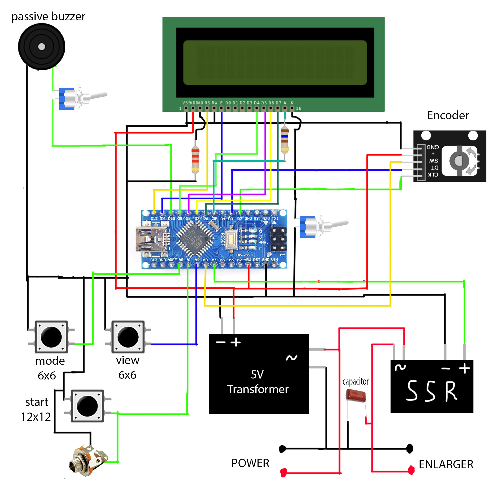

# Удобное реле времени со множеством фишек

## Этот проект вдохновлен [прошлой версией похожего реле](https://github.com/nikonov1101/kafstop-timer), но улучшает его и расширяет его возможности

## Инструкция

1. Кликни кнопку просмотра, чтобы включить/выключить лампу
2. Кликни кнопку переключения режима, чтобы переключить режим
3. Кликни кнопку на энкодере, чтобы перемещаться внутри самого режима
4. Удерживай кнопку на энкодере, чтобы сбросить печать в любом режиме
5. Кликни кнопку старта, чтобы начать печать в любом режиме
6. Удерживай нопку просмотра и переключения режима, чтобы войти в режим настроек (можно устанавливать лаг запуска лампыи громкость пищалки)
7. Перемещение внури режимов настройки происходит по нажатию на кнопку переключения режимов
8. Чтобы сохранить настройки, снова ужерживай кнопку просмотра и переключения режимов

## Режими

1. Тест F стопами: позволяет произвести быстрый тест для подбора тона изображения повышая каждый следующий тест на заданный тон. Размер тона можно уменьшать. После печати вы можете посмотреть лог печати
2. Линейный тест: Задается начальное значение и шаг
3. Режим печати: можете задать время и печатать с ним. Дополнительно есть возможность остановки печати и печати по удержанию кнопки (удобно для маскирования и коротких выдержках).
4. Режим маскирования: задайте количество масок и время, которое нужено для засветки определенной маски

## Killer фичи:

1. Есть возможность останоить любую печать. Это может быть удобно, если вы обнаружили, что забыли убрать красный фильтр
2. Есть возможность задать лаг запуска лампы. Некоторые фотоувеличители запускают лампу не сразу, а с некоророй задержкой. Чтобы компенсировать это значение, задайте лаг старта. Это значение будет отсчитываться перед любым запуском таймера и не будет учитываться. Чтобы определить задержку, перейдите в настройки и установите значение на глаз. Нажмите на кнопку старт, чтобы проверить его. Если за это время лампа не включилась, увеличьте это значение, иначе попробуйте уменьшить.
3. Пищилка, которая срабатывает раз в 1 секунду. Удобно для быстрого маскирования.
4. Возможность отключения подсветки дисплея. Удобно для цветной печати
5. Простая архитектура проекта, которая позводит вам с легкостью добавить новые настройки и режимы по необходимости

## Компоненты

1. [Энкодер EC11](https://sl.aliexpress.ru/p?key=1wDHs4W)
2. [Кнопка 12x12](https://sl.aliexpress.ru/p?key=8sDHsMU)
3. [Копка 6x6](https://sl.aliexpress.ru/p?key=TiDHsci)
4. [LED](https://sl.aliexpress.ru/p?key=tgDHsiN)
5. [Пассивный зумер](https://sl.aliexpress.ru/p?key=XcDHsAE)
6. [Твердотельное реле 5V](https://sl.aliexpress.ru/p?key=AWDHsN6)
7. [Тумблер](https://sl.aliexpress.ru/p?key=7LDHstq)
8. трансформатор на 5V -- вы можете просто разобрать любую USB зарядку для телефона (5V, 2.4A должно быть достаточно)
9. Arduino nano: советую взять именно версию с процессором ATmega 328P. Версии с ATmega 168 могут иметь недостаточно памяти, для прошивки.
10. Конденсатор. Нужен для устранения утечек из твердотельного реле. Я использовал метало-пленочный конденсатор емкостью 1 мкФ для 250V. Его можно не ставить, если вы не планируете использовать реле с маломожными лампами
11. Используется всего два резистора. Первый для установки яркости подсветки (160 Ом) и второй для установки констраста дисплея (2.2 кОм). Ваши значения могут отличаться от моих.
12. Пружинки для кнопки старта можно достать из шариковых ручек
13. Также советвую купить любую педаль сустейня для и подключать ее через Jack гнездо. Это будет очень удобно при маскировании. Я купил дешевую "Cherub wtb-006" и не жалуюсь

## Схема

## Корпус

[3D модель корпуса](./TimeRelayBox.stl)

## Сценарий использования

Интерфейс реле устроен таким образом, чтобы соответствовать вашему воркфлоу. Я предлагаю его использовать так:
1. Сначала в режиме тестов F стопами подобрать грубое время печати
2. Далее подобрать более точное время линейными тестами (или через F стопами с небольшим значением шага, например 1/5)
3. После этого напечатать изображение целиком в режиме печати
4. В следующий раз в этом же режиме попробовать грубо замаскировать изображение и получить примерное значение масок
5. В следующий раз напечатать это же изображения в режиме маскирования зная точные значения масок

### Пример:

1. Печатаю изображение f стопами: выставляю начальное значние 2, шаг 1 и делаю 6 тестов (2, 4, 8, 16, 32, 64). Увидел, что желаемое изображение находится в пределах 16 и 32
2. Подбор более точно значения печати:
  a. Тест f стопами: Печатаю изображение снова f стопами, но на этот раз взяв шаг 1/4. делаю 5 тестов. Увидел, что значение на 4ом тесте меня устраивает. Смотрю лог печати: 16, 19, 23, 27, 32. Мне нравится 4ый тест, значит искомое значение 27
  b. Линейный тест: Делаю 5 тестов от 16 до 32: 16, 20, 24, 28, 32. Нам понравилось 4ое значение: 28
3. Делаем полную печать в режиме печати со значение 28
4. Увидели, что есть некоторые участки, которые хотелось бы пересветить на 3 секунды и недосветить на 8 секунд. Для этого, выставляю в режиме печати 31 секунду. Маскирую часть, которую нужно пересветить на 3 секунды. Запускаю реле и отсчитываю 3 секунды (через писки). Останвиваюсь, затем маскирую часть, которую нужно замаскировтаь на 8 секунд. Запускаю реле и отсчитываю 8 секунд. Останавливаюсь, убираю маски и засвечиваю оставшуюся части изображения как есть
5. Если хочу получить повторяемый результат и сделать несколько похожих отпечатков, перехожу в режим маскирования. Выставляю маски, 3, 8, 20 и повторяю ту же самую процедуру. Таймер будет останавливаться после засветки каждой из масок

